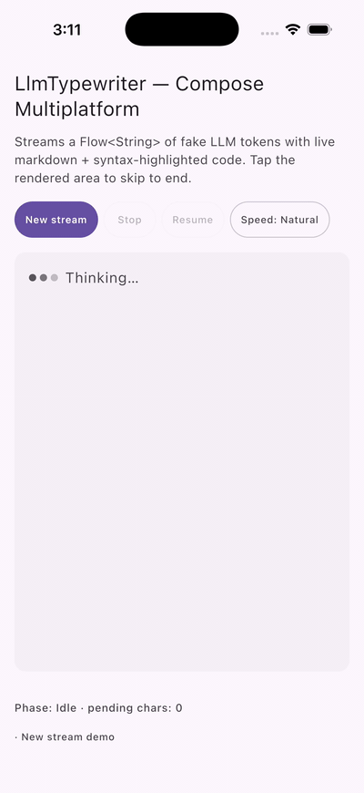

# LlmTypewriter

**The streaming-text typewriter built for LLM apps on Compose.** Renders a
`Flow<String>` of tokens with live progressive Markdown, syntax-highlighted code
blocks that build up as tokens arrive, inline `$…$` and display `$$…$$` LaTeX
math, three speed curves (linear / ease-out / natural), tap-to-skip,
graceful stop-mid-stream, selectable text, and a
screen-reader-friendly live region.

[](https://central.sonatype.com/artifact/cc.ptoe/llm-typewriter)
[](LICENSE)
[](https://github.com/ECSDevs/llm-typewriter/actions/workflows/build.yml)

<p align="center">
  
</p>

> **Pairs naturally with [`prompt-bar`](https://github.com/ECSDevs/prompt-bar)** — drop both in and you have a ChatGPT-quality chat UI on Android in ~20 lines. PromptBar's Send/Stop button auto-syncs with `state.isStreaming`.

## Why another typewriter?

Existing CMP typewriters take a static `String` — they're animations, not stream renderers.
LlmTypewriter is built around the **AI chatbot streaming-token use case** that nobody else has
shipped:

| Capability | LlmTypewriter | Typist-CMP | Texty | GetStream `StreamingText` |
|---|---|---|---|---|
| `Flow<String>` source | ✅ | ❌ static string | ❌ static string | ✅ Android-only |
| Live progressive Markdown | ✅ | ❌ | ❌ | ❌ |
| Syntax-highlighted code blocks (live) | ✅ 17 languages (Highlights) | ❌ | ❌ | ❌ |
| LaTeX math (`$…$` / `$$…$$`) | ✅ AndroidMath | ❌ | ❌ | ❌ |
| Speed curves (linear / easeOut / natural) | ✅ | ❌ linear only | ❌ linear only | ❌ |
| Tap-to-skip | ✅ | ❌ | ❌ | ❌ |
| Graceful stop-mid-stream | ✅ | ❌ | ❌ | partial |
| Selectable text mid-stream | ✅ | ❌ | ❌ | partial |
| A11y live-region announcements | ✅ | ❌ | ❌ | partial |
| Active maintenance | ✅ | ❌ stale ~2y | ⚠️ alpha | locked in chat SDK |

## Install

The library is on Maven Central. **One extra line is required:** math rendering
pulls in [AndroidMath](https://github.com/gregcockroft/AndroidMath) transitively,
which is hosted on JitPack — declare both repos in `settings.gradle.kts`:

```kotlin
dependencyResolutionManagement {
    repositories {
        google()
        mavenCentral()
        maven { url = uri("https://jitpack.io") }   // required for AndroidMath
    }
}
```

Then add the dependency (Kotlin DSL):

```kotlin
// module build.gradle.kts
dependencies {
    implementation("cc.ptoe:llm-typewriter:0.1.0")
}
```

Groovy DSL:

```groovy
dependencies {
    implementation 'cc.ptoe:llm-typewriter:0.1.0'
}
```

Version catalog (`gradle/libs.versions.toml`):

```toml
[versions]
llmTypewriter = "0.1.0"

[libraries]
llm-typewriter = { module = "cc.ptoe:llm-typewriter", version.ref = "llmTypewriter" }
```

```kotlin
dependencies {
    implementation(libs.llm.typewriter)
}
```

**Requirements:** Android minSdk 24, Compose Multiplatform 1.10+, Kotlin 2.3+.

## Quick start

```kotlin
import cc.ptoe.llmtypewriter.*

@Composable
fun ChatBubble(responseFlow: Flow<String>) {
    val state = rememberStreamingTypewriterState()
    StreamingTypewriter(
        tokens = responseFlow,                              // Flow<String> from your LLM
        state = state,
        renderer = rememberMarkdownTypewriterRenderer(state), // live Markdown + code + math
        speedCurve = SpeedCurve.Natural,
    )
    Button(onClick = { state.stop() }, enabled = state.isStreaming) {
        Text("Stop")
    }
}
```

That's it — tokens stream in, the typewriter reveals them at a natural cadence,
renders Markdown progressively (bold the instant `**` closes, code blocks that
highlight as they grow, and math once the closing `$` arrives). Tap the text to
skip to the latest buffered token.

## Core composables

### `StreamingTypewriter` — the streaming renderer

```kotlin
@Composable
fun StreamingTypewriter(
    tokens: Flow<String>,
    modifier: Modifier = Modifier,
    state: StreamingTypewriterState = rememberStreamingTypewriterState(),
    renderer: TypewriterRenderer = PlainTypewriterRenderer,
    baseDelayMs: Long = LlmTypewriterDefaults.DefaultBaseDelayMs,   // 18 ms ≈ 55 ch/s
    speedCurve: SpeedCurve = SpeedCurve.Natural,
    tapToSkip: Boolean = true,
    announceForAccessibility: Boolean = true,
)
```

| Parameter | Default | Purpose |
|---|---|---|
| `tokens` | — | The upstream `Flow<String>`. Each emission is appended to the reveal buffer. Swapping the flow (e.g. "Regenerate") cancels the old collector and starts fresh. |
| `state` | `rememberStreamingTypewriterState()` | Holds the buffer + reveal phase. Hoist it to drive from a `ViewModel` or to read `isStreaming` / `phase` elsewhere. |
| `renderer` | `PlainTypewriterRenderer` | How revealed text is painted. Use `rememberMarkdownTypewriterRenderer(state)` for Markdown + code + math. |
| `baseDelayMs` | `18L` | Baseline per-character delay. The effective delay is modulated by `speedCurve`. |
| `speedCurve` | `SpeedCurve.Natural` | Cadence curve — see [Speed curves](#speed-curves). |
| `tapToSkip` | `true` | Tap the rendered area to flush the buffer instantly. |
| `announceForAccessibility` | `true` | Wraps the text in a `liveRegion = Polite` semantics node so screen readers narrate progress. |

**Test tags:** `llm_typewriter` (root), `llm_typewriter_text` (text area),
`llm_typewriter_stopped` (stop indicator).

### `TypewriterText` — static text

For non-streaming use cases (hero banners, onboarding copy, demos). Internally
builds a character-by-character flow and delegates to `StreamingTypewriter`:

```kotlin
TypewriterText(
    text = "Build LLM-powered apps for Android.",
    speedCurve = SpeedCurve.Natural,
)
```

Accepts the same `renderer`, `baseDelayMs`, `speedCurve`, and
`tapToSkip` parameters as `StreamingTypewriter`.

### `CyclingTypewriterText` — rotating banner

Types one phrase, holds, deletes back to empty, types the next — loops forever.
Plain-text only (no Markdown):

```kotlin
CyclingTypewriterText(
    phrases = listOf("Type", "Stream", "Render", "On Android"),
    holdMs = 1200L,
    typeDelayMs = 18L,
    deleteDelayMs = 9L,
)
```

## State API (headless)

`StreamingTypewriterState` is the single source of truth — the composables are
thin wrappers. The primary constructor is **public**, so you can create and
drive a state from anywhere without composition:

```kotlin
class ChatViewModel : ViewModel() {
    val typewriterState = StreamingTypewriterState()

    fun startResponse(llm: Flow<String>) {
        viewModelScope.launch {
            typewriterState.reset()
            llm.collect { token -> typewriterState.appendToken(token) }
            typewriterState.completeSource()
        }
    }
}
```

### Phases

| Phase | Meaning |
|---|---|
| `Idle` | Initial state; nothing buffered, nothing revealing. Also the state after `reset()`. |
| `Revealing` | The reveal loop is actively pulling characters off the buffer. |
| `Waiting` | Source hasn't completed but the reveal loop caught up to the buffer tail. |
| `Done` | Source completed and every buffered character has been revealed. |
| `Stopped` | User/control interrupted the reveal. Pending chars stay buffered and unrevealed. |

### Control surface

```kotlin
val state = StreamingTypewriterState()

state.appendToken("Hello, ")      // push a token into the buffer
state.appendToken("world!")
state.completeSource()            // signal the source flow is done

state.skipToEnd()                 // flush everything now (used by tap-to-skip)
state.stop()                      // freeze mid-stream — buffered text stays hidden
state.resume()                    // pick up exactly where stop() left off
state.reset()                     // erase everything — start fresh (e.g. "Regenerate")
```

### Observables

```kotlin
state.revealed        // String — what's currently painted
state.phase           // TypewriterPhase
state.pendingChars    // Int — buffered but not yet revealed
state.sourceComplete  // Boolean
state.isStreaming     // extension: true when Revealing or Waiting
state.bufferSoftCap   // Int — advisory memory guard (default 4000)

// Composable helper — flips true the moment the first char is revealed.
// Handy for hiding a "Thinking…" indicator when real text arrives.
val hasText by state.rememberHasRevealedText()
```

## Renderers

| Renderer | What it does |
|---|---|
| `PlainTypewriterRenderer` | Paints raw text in the ambient `TextStyle`. Zero parsing cost. |
| `rememberMarkdownTypewriterRenderer(state)` | Live progressive Markdown — headings, bold, italic, strikethrough, inline code, links, fenced code blocks with **per-language syntax highlighting** via [Highlights](https://github.com/SnipMeDev/Highlights) (Kotlin, Java, JS/TS, Python, C/C++, Go, Rust, Swift, …), and inline `$…$` / display `$$…$$` LaTeX math. |

```kotlin
// Default styles resolve against MaterialTheme
val renderer = rememberMarkdownTypewriterRenderer(state)

// Or supply your own MarkdownStyles
val renderer = rememberMarkdownTypewriterRenderer(
    state = state,
    styles = LlmTypewriterDefaults.markdownStyles().copy(
        codeBlockBackground = Color(0xFF1E1E1E),
        codeBlockText = Color(0xFFD4D4D4),
    ),
)
```

### Markdown feature coverage

| Syntax | Renders as |
|---|---|
| `# H1` … `###### H6` | Headings, scaled 1.8× / 1.5× / 1.3× / 1.1× / 1.0× / 0.9× of body size |
| `**bold**` | Bold (SemiBold) |
| `*italic*` | Italic |
| `***bold italic***` | Bold + italic |
| `~~strike~~` | Strikethrough |
| `` `code` `` | Inline code (monospace, surfaceVariant background) |
| `[label](url)` | Clickable link (primary color, underlined) |
| ` ```kotlin … ``` ` | Fenced code block with syntax highlighting |
| Single newline | Soft break (rendered as a space) — CommonMark |
| Blank line (2+ newlines) | Paragraph break |
| `$…$` | Inline LaTeX math (text style) |
| `$$…$$` | Display LaTeX math (display style, centered, background tint, 1.2× scale) |

### Prefix stability

The streaming Markdown parser is **prefix-stable**: for any prefix of the input,
it produces the same prefix of tokens. A `**bold` mid-stream renders as plain
text until the closing `**` arrives — but every token *before* that opening
`**` stays exactly where it was. Code fences highlight progressively as tokens
stream in — no waiting for the closing ` ``` `. This is what makes live
streaming render without visual jitter.

## LaTeX math rendering

Math is delegated to [AndroidMath](https://github.com/gregcockroft/AndroidMath)'s
`MTMathView`, which renders LaTeX with native Freetype typography (Latin Modern
Math / Tex Gyre Termes / XITS Math fonts). This gives you proper fractions,
stacked big-operator limits, roots with vincula, and the rest of the LaTeX
grammar — not a hand-rolled approximation.

**Inline math** — `$E = mc^2$` — renders in text style, inline with surrounding
words, and wraps naturally at word boundaries. Each equation's width is
pre-measured so surrounding text reflows correctly.

**Display math** — `$$\sum_{i=1}^{n} \frac{1}{i^2}$$` — renders block-level,
centered, on its own line with a subtle background tint and a 1.2× font scale.

```markdown
The area of a circle is $A = \pi r^2$. For the sum of a series:

$$\sum_{n=1}^{\infty} \frac{1}{n^2} = \frac{\pi^2}{6}$$

And a matrix: $\begin{pmatrix}a & b \\ c & d\end{pmatrix}$
```

**Rendering rule:** math renders only after the closing `$` / `$$` has arrived.
Before that, the parser emits the partial input as plain text — so a half-streamed
`$\frac{1}{` shows up as literal characters until the closing `$` lands. This
guarantees the math backend never sees a half-formed LaTeX string.

Only the `color` from `MarkdownStyles.math` is honored; AndroidMath owns the
typography (font family, style, weight). Display-math background and scale are
configurable via `MarkdownStyles.displayMathBackground` and `displayScale`.

## Speed curves

| Curve | Behaviour | Use for |
|---|---|---|
| `SpeedCurve.Linear` | Constant cadence — every char takes `baseDelayMs`. | Logs, terminals |
| `SpeedCurve.EaseOut` | Slight stretch (~1.4×) on whitespace. | Marketing copy |
| `SpeedCurve.Natural` | Pauses on `.!?,;:` (6×/3×) and newlines (5×); tiny breather on word-end space (1.4×); slower first char of a new paragraph (1.8×). Simulates a human typist. | LLM chat, intros |

`SpeedCurve` is a `fun interface` — supply your own:

```kotlin
val snappy = SpeedCurve { base, prev, next ->
    if (next == '\n') base * 8 else base / 2
}
StreamingTypewriter(tokens = tokens, speedCurve = snappy)
```

## Customization

### Custom renderer

`TypewriterRenderer` is a `fun interface` — paint the revealed `String` however
you like:

```kotlin
val upperRenderer = TypewriterRenderer { text, modifier ->
    Text(text = text.uppercase(), modifier = modifier)
}
StreamingTypewriter(tokens = tokens, renderer = upperRenderer)
```

### Custom `MarkdownStyles`

All Markdown styling resolves against `MaterialTheme` by default. Override any
field:

```kotlin
val darkCode = LlmTypewriterDefaults.markdownStyles().copy(
    codeBlockBackground = Color(0xFF1E1E1E),
    codeBlockText       = Color(0xFFD4D4D4),
    codeBlockKeyword    = Color(0xFF569CD6),
    codeBlockString     = Color(0xFFCE9178),
    codeBlockComment    = Color(0xFF6A9955),
    codeBlockNumber     = Color(0xFFB5CEA8),
    math                = SpanStyle(color = Color(0xFFE0E0E0),
                          background = Color(0xFF2D2D2D)),
    displayMathBackground = Color(0xFF1E1E1E),
    displayScale        = 1.3f,
)
val renderer = rememberMarkdownTypewriterRenderer(state, darkCode)
```

`MarkdownStyles` fields: `bold`, `italic`, `code`, `link`, `heading`,
`strikethrough`, `codeBlockBackground`, `codeBlockText`, `codeBlockKeyword`,
`codeBlockString`, `codeBlockComment`, `codeBlockNumber`, `math`,
`displayMathBackground`, `displayScale`.

## Accessibility

When `announceForAccessibility = true` (default), the rendered text is wrapped in
a `liveRegion = Polite` semantics node. Screen readers narrate the revealed text
as it grows without interrupting the user. The live region is preferred over
`contentDescription` so the underlying `Text` node's value is announced (and
text-equality assertions in tests still work).

## Thinking indicator

`ThinkingDots` — three pulsing dots, the classic "assistant is thinking" indicator.
Show it before the first token arrives, hide it the moment real text appears:

```kotlin
val state = rememberStreamingTypewriterState()
val hasText by state.rememberHasRevealedText()

if (!hasText) ThinkingDots()
else StreamingTypewriter(tokens = tokens, state = state, /* … */)
```

## Testing helpers

```kotlin
// Emit each character as a one-char token
val flow = staticFlowOf("Hello, world!")

// Emit each word as a token (closer to real LLM streaming)
val flow = wordTokenFlowOf("Hello world from an LLM", perTokenDelayMs = 80L)
```

The headless state is fully drivable in pure unit tests — no Compose runtime
required. All control-surface methods (`appendToken`, `completeSource`,
`skipToEnd`, `stop`, `resume`, `reset`) and observables (`revealed`, `phase`,
`pendingChars`, `isStreaming`) are public:

```kotlin
@Test fun `skipToEnd flushes the buffer`() {
    val state = StreamingTypewriterState()
    state.appendToken("Hi")
    assertEquals("", state.revealed)       // buffered but not yet revealed
    state.skipToEnd()
    assertEquals("Hi", state.revealed)
    assertEquals(TypewriterPhase.Waiting, state.phase)  // source not yet completed
}

@Test fun `stop freezes the reveal`() {
    val state = StreamingTypewriterState()
    state.appendToken("Hello")
    state.stop()
    assertEquals(TypewriterPhase.Stopped, state.phase)
    state.resume()
    assertEquals(TypewriterPhase.Revealing, state.phase)
}
```

## Sample app

```bash
./gradlew :sample:androidApp:assembleDebug
```

The sample includes a fake-LLM that streams pre-canned responses with Markdown +
code blocks + math, a speed-curve switcher, and Stop / Resume / Skip controls.

## Testing

```bash
./gradlew :llm-typewriter:testDebugUnitTest            # pure-logic unit tests (fastest)
./gradlew :llm-typewriter:connectedAndroidTest         # Compose UI instrumented tests
./gradlew build                                         # build + test everything
```

Pure-logic tests cover the Markdown stream parser, TeX parser, math AST, code
highlighter, speed curves, state machine, and paragraph grouping — no Compose
runtime needed. Compose UI tests cover tap-to-skip, stop indicator, and test-tag
wiring.

## Platforms

| Target | Status |
|---|---|
| Android (minSdk 24) | ✅ |

The library targets Android only. Math rendering depends on AndroidMath's
`MTMathView`, which is Android-native.

## Releasing

Tag-driven. Pushing a `v*` tag triggers
[`.github/workflows/publish.yml`](.github/workflows/publish.yml), which publishes
to Maven Central via `com.vanniktech.maven.publish` and creates a GitHub Release.
The version comes from the tag (`v0.2.0` → `0.2.0`); override locally with
`-Pversion=...`.

## Credits

This project is a fork of [`NadeemIqbal/llm-typewriter`](https://github.com/NadeemIqbal/llm-typewriter).
The original StreamingTypewriter design — the `Flow<String>`-driven reveal loop,
the headless `StreamingTypewriterState` phase machine, the prefix-stable Markdown
parser, and the speed-curve abstraction — was authored by
**[NadeemIqbal](https://github.com/NadeemIqbal)** and is gratefully acknowledged.

This fork **detached from the upstream GitHub fork network** because the two
projects have diverged substantially:

- **Target platform:** Android only (upstream targets Compose Multiplatform).
- **LaTeX math:** this fork adds streaming `$…$` / `$$…$$` math rendering via
  [AndroidMath](https://github.com/gregcockroft/AndroidMath)'s `MTMathView`,
  plus a prefix-stable TeX lexer and semantic math AST.
- **Performance:** incremental Markdown re-parse, O(1) reveal tracking, and
  process-wide math-measurement caching — none of which are in upstream.
- **Markdown layout:** CommonMark soft-break handling, inline math reflow via
  `InlineTextContent`, and heading-size scaling.

Attribution is also preserved in the published Maven POM (`<developers>` lists
both the upstream author and the current maintainer) and in the
[LICENSE](LICENSE) file. All code — original and modified — remains under the
Apache License, Version 2.0.

If you upstream-read this and want to cherry-pick anything back, please open a
PR — we're happy to help.

## License

Apache 2.0 — see [LICENSE](LICENSE). Original portions Copyright © 2026
NadeemIqbal; modifications Copyright © 2026 originalFactor. Both are licensed
under the Apache License, Version 2.0.
